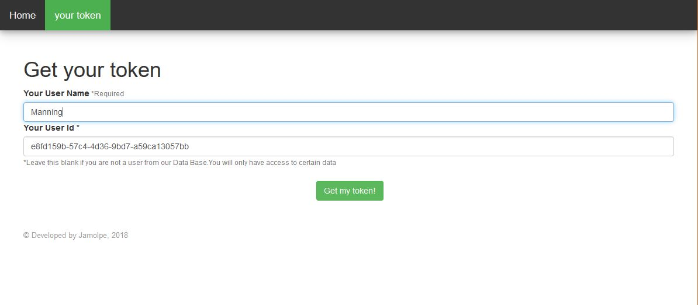
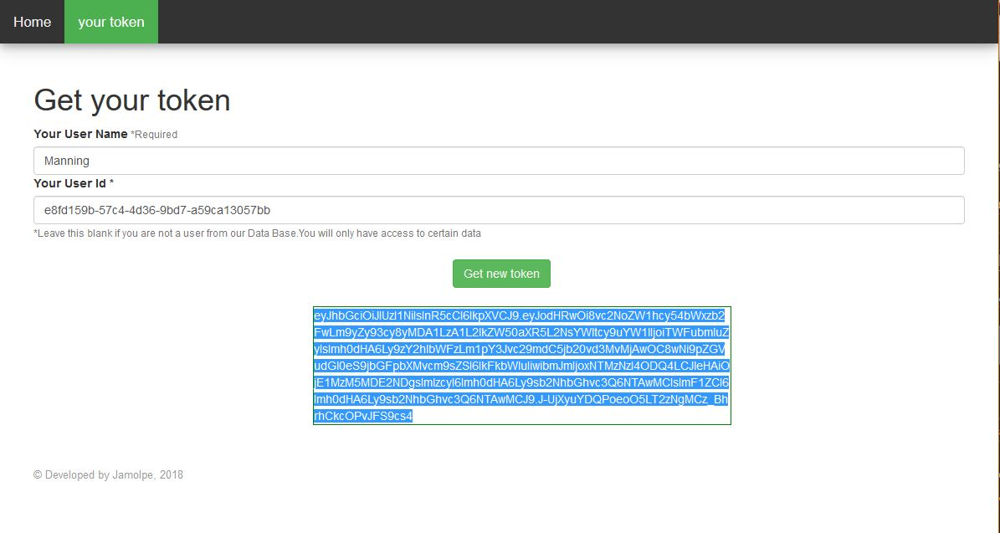
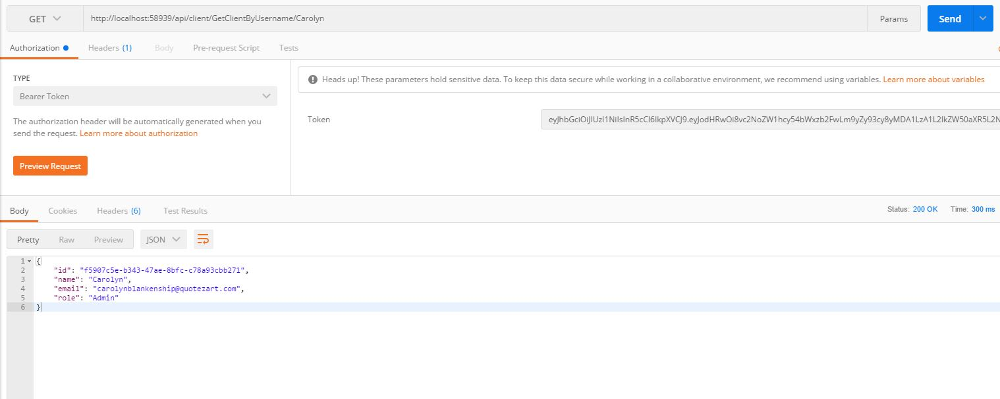
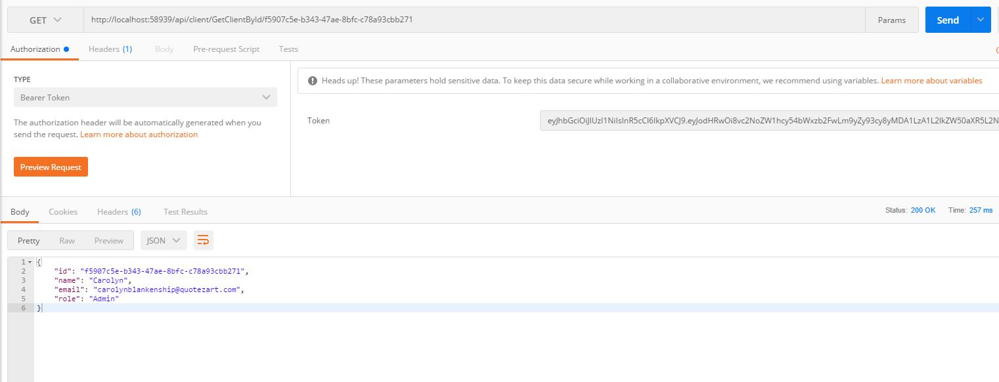
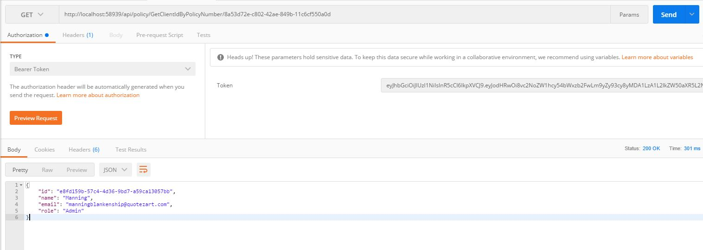
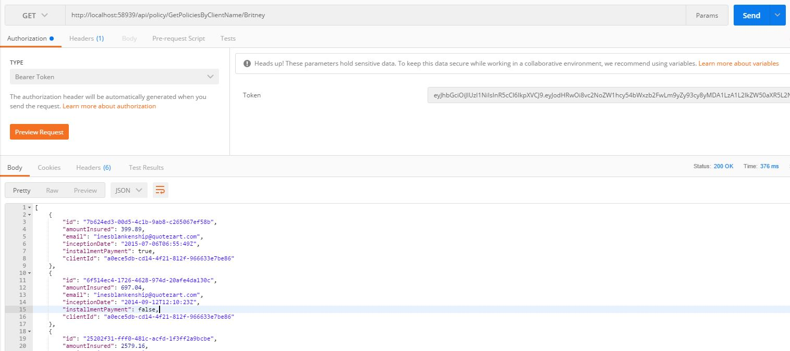
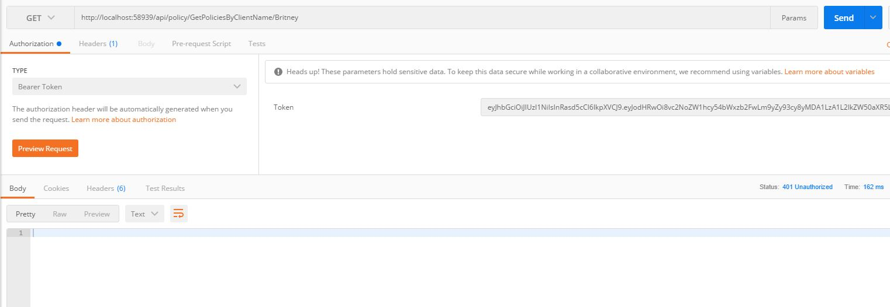

# AxaAssesment
--------

## Tecnologías

Para el desarrollo de esta api se han utilizado las siguientes tecnologías y herramientas:

* Postman
* Visual Studio code / Visual Studio mac / Visual Studio 2017
* React and TypeScript for client-side code
* ASP.NET Core and C# for cross-platform server-side code
* Webpack for building and bundling client-side resources
* Bootstrap for layout and styling
* LinQ

Why ASP.NET core? he seleccionado esta tecnología dado que es de las más actuales, potentes y multiplataforma que nos permite trabajar y desplegar tanto en entornos Windows como en Mac o Linux.

### Estructuración del proyecto

En este proyecto se ha generado una libreria aparte que realiza la lógica de acceso y cálculos sobre los recursos de clientes y policies, esto permite que se pueda migrar esta libreria a un paquete nugget y añadirla en cualquier proyecto que se necesite acceso y cálculo de clietnes y policies.

Por otro lado encontramos el proyecto ASP.NET Core de api rest y front-end con react donde se ha seguido un patrón MVC.

## Instalación
--------

Para poder ejecutar la API es necesario realizar la instalación de las dependencias **npm** en el directorio principal *(AxaAssesment\AxaAssesment\AxaAssesment)* donde se encuentra el archivo package.json

```console
npm install
```

También restaurar los paketes nugget del proyecto.

## Configuración
--------
En este proyecto se pueden configurar diferentes elementos de la API:
* URL obtención de clientes
* URL Obtención de policies
* Issuer del token generator
* Audeince del token generator
* Secret key para generación de token
* Activacion o desactivación del acceso a terceros a generación de tokens
* Tiempo de expiración en días de los tokens

```json
{
  "Logging": {
    "LogLevel": {
      "Default": "Warning"
    }
  },
  "ApiConfiguration": {
    "ClientsUrl": "http://www.mocky.io/v2/5808862710000087232b75ac",
    "PoliciesUrl": "http://www.mocky.io/v2/580891a4100000e8242b75c5",
    "issuer": "http://localhost:5000",
    "audience": "http://localhost:5000",
    "SecretKey": "AxaTestKeyForToken",
    "ThirdPartiesTokensActive": true,
    "TokenExpirationDays":  2 
  } 
}
```
Estos elementos se encuentran en el archivo appsettings.json

## Funcionamiento

### Obtencion de permisos de acceso

El funcionamiento de la api es sencillo una vez arrancado el proyecto podremos ver en el navegador una pequeña presentación Front-End en react donde encontraremos una parte generadora de tokens tanto para clientes existentes en la Base de datos como para terceros.



Existen 2 maneras de generar tokens según el tipo de usuario.
* **Tokens para usuarios de la base de datos**: Introduciendo un nombre de usuario (obligatorio) y el id del usuario del que vamos a obtener el token. Esto es importante ya que este id es el que define con que usuario vamos a realizar las peticiones y su rol dependerá del rol que tenga asignado en la Base de datos del servicio, Es decir:
*Usando el id del usuario (e8fd159b-57c4-4d36-9bd7-a59ca13057bb) obtendremos su token correspondiente y acceso a nivel de administrador, ya que este usuario en la base de datos del servicio tiene un Rol de administrador*
* **Tokens para terceros**: Introduciendo solo el nombre de usuario(obligatorio) podremos generar un token, por defecto estos usuarios tienen un rol de acceso como usuario.

Una vez pulsado el botón obtener token nos aparecerá un recuadro con el token dentro:




Además de por esta pequeña app front-end se puede realizar la obtencion de tokens mediante peticiones a la api:

**/api/security/token** enviando los datos necesarios en el body de la request:

```json
{
	"Username" : "username",
	"UserId" : "iddeluser",
	"IsThirdParties":false
}
```

* Username es obligatorio.
* UserId es el id del usuario en nuestra Base de datos de clientes, si no se envía nada se entiende que es un usuario a terceros y se le dará un acceso con rol de user.
* IsThirdParties indica si es un usuario a terceros directamente.

### Uso del token

una vez obtenido el token podremos realizar llamadas a la API, la api cuenta con las siguientes llamadas y su correspondiente permiso de acceso:

* **/api/client/GetClientByUsername/{username}**: obtenemos la informacion de un cliente por el nombre de cliente. **Nivel de acceso**: Users y Admin



* **/api/client/GetClientById/{id}**: obtenemos la informacion de un cliente por el id de cliente. **Nivel de acceso**: Users y Admin



* **/api/client/GetClientIdByPolicyNumber/{policyNumber}**: obtenemos la informacion de un cliente por el PolicyNumber. **Nivel de acceso**: Admin




* **/api/client/GetPoliciesByClientName/{username}**: obtenemos la lista de policies de un cliente por el nombre. **Nivel de acceso**: Admin




En el caso de intentar hacer llamadas a la api sin tener el nivel de acceso o token necesario la Api nos devolverá un 401 no autorizado




# Créditos

<sub>Proyecto desarrollado por Javier Molpeceres Gómez como Assesment para AXA, la explotación y utilización de este proyecto sin el consentimiento del desarrollador queda totalmente prohibida.